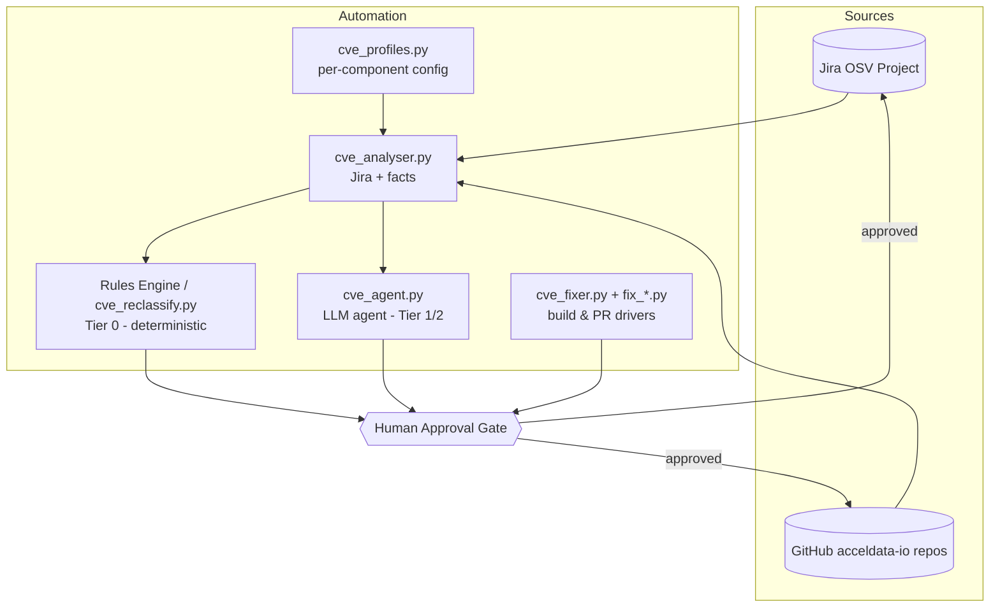
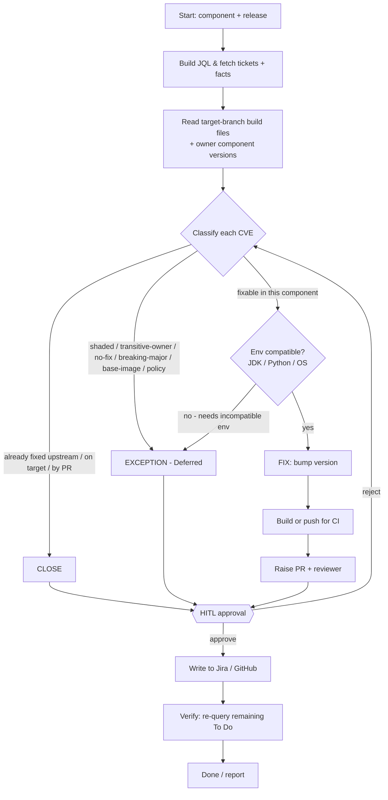
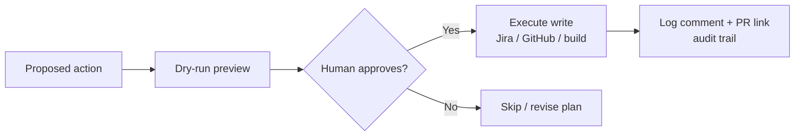
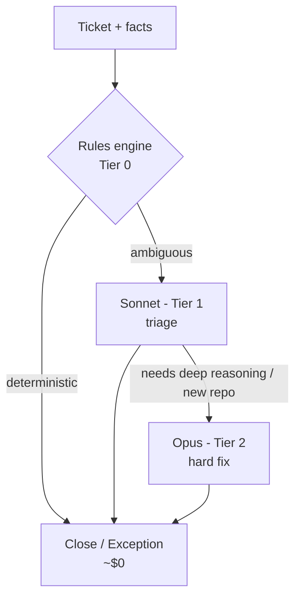
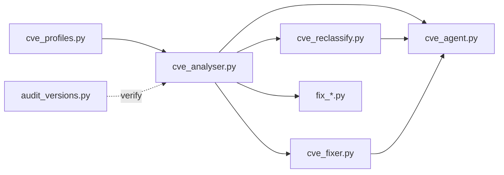

# CVE Remediation Automation for ODP — Proposal & Design

> **Status:** Proposal for approval  **Owner:** Senthil Kumar  **Audience:** Engineering Management / Security
> **Purpose:** Approve adoption of an AI-assisted, human-in-the-loop automation for triaging and remediating CVEs across ODP components.

> ℹ️ **How to use this page in Confluence:** paste this Markdown into a Confluence page (Confluence Cloud auto-converts Markdown on paste). The diagrams are written in **Mermaid** — render them with the *Mermaid Diagrams* macro/app, or use the ASCII fallback provided under the main flow.

---

## Table of Contents
1. [Objective](#1-objective)
2. [Why We Need Automation](#2-why-we-need-automation)
3. [Solution Overview & Architecture](#3-solution-overview--architecture)
4. [How It Works — End-to-End Flow](#4-how-it-works--end-to-end-flow)
5. [Human-in-the-Loop (HITL) Controls](#5-human-in-the-loop-hitl-controls)
6. [Exception Request Rules](#6-exception-request-rules)
7. [Libraries Bumped per Component](#7-libraries-bumped-per-component)
8. [Cost Model — Hybrid Opus + Sonnet](#8-cost-model--hybrid-opus--sonnet)
9. [Files & Functionalities](#9-files--functionalities)
10. [Security, Governance & Hardening](#10-security-governance--hardening)
11. [Rollout Plan & The Ask](#11-rollout-plan--the-ask)

---

## 1. Objective

Provide a **repeatable, auditable, low-cost automation** that takes the CVEs reported against ODP components (tracked as OSV Jira tickets) and drives each one to a correct, defensible resolution:

- **FIX** — bump the vulnerable library to a patched version **that is compatible with the component's runtime environment**, build, raise a PR.
- **CLOSE** — the CVE is already resolved (fixed in the owning component, or already on the target branch, or fixed by our PR).
- **EXCEPTION REQUEST** — the CVE genuinely cannot/should not be fixed in this component (shaded, transitive/owner-owned, no upstream fix, breaking major, **environment/compatibility constraint**, base-image, or policy), recorded with a standard reason and detailed justification.

The automation must be **scoped strictly per release**, keep a **human approval gate on every write**, and produce a **clear audit trail** in Jira and GitHub.

### 1.1 Environment compatibility is a first-class check (per review feedback)

A patched library version is only a valid **FIX** if it runs on the component's actual runtime. Before proposing any bump, the automation validates the fix against the component's environment constraints, and **routes to EXCEPTION (or flags for an environment-upgrade decision) when the only fix requires an incompatible environment change**:

| Environment dimension | What we check | Example impact on the decision |
|---|---|---|
| **JDK / Java version** | Does the patched jar's minimum Java baseline match the component's build/runtime JDK? (e.g. components pinned to **JDK 8** — nifi, ranger, oozie; others on JDK 11/17) | A fix that requires Java 11+ cannot land on a JDK 8 component → EXCEPTION *(environment/compatibility)* or a scoped JDK-upgrade decision. |
| **Python version** | For Python components (airflow, hue, jupyterhub, superset), does the patched package support the pinned Python interpreter? | A package that drops the shipped Python version → EXCEPTION or Python-upgrade decision, not a silent bump. |
| **OS / base-image compatibility** | Is the fix tied to the container **base image** / OS packages (glibc, OpenSSL, Go toolchain, native libs) rather than the app build? | Base-image/OS-owned findings (e.g. Go-stdlib, OS packages) → resolved via **base-image refresh/rebuild**, not an app-level bump. |
| **Transitive/ABI compatibility** | Does the bump break API/ABI for dependents in the same component (breaking major)? | Breaking-major fix → EXCEPTION *(breaking major)* until a coordinated upgrade. |

These environment facts come from the per-component **profile** (`java_home`/JDK, `build_cmd`, Python/build-tool markers) and, where needed, the component's build files and container **Dockerfile/base image** — so the FIX vs EXCEPTION decision is made with the runtime constraints in view, never on library version alone.

> **Note:** the OSV Jira workflow already exposes a **"Backward Compatibility Constraint"** status, which is the natural landing state for environment/compatibility-driven exceptions surfaced by this check.

---

## 2. Why We Need Automation

### The scale problem (real data)
For a single release baseline (**3.3.6.4**), the current open CVE load is:

| Metric | Value |
|---|---|
| Total CVE tickets (Critical/High/Medium) | **2,776** |
| In "To Do" (unactioned) | **2,717** |
| Components affected | **43** |
| Severity split | 252 Critical / 1,339 High / 1,185 Medium |

Largest components: oozie (232), ranger (169), zeppelin (144), impala (124), hive (115), airflow (104), spark3 (96), kudu (95)… down to sqoop (9), zookeeper (7). **This repeats every release.**

### Why manual handling does not scale
- **Volume:** ~2,700 tickets/release × multiple releases. Manual triage is weeks of senior engineering time.
- **Repetitiveness:** ~70–80% of tickets are *mechanical* decisions (already fixed upstream / shaded in a third-party jar / owned by another component). Engineers should not hand-process these.
- **Consistency & audit:** manual exceptions vary in wording and rigor; auditors need uniform, justified records.
- **Release scoping errors:** the *same* CVE exists as separate tickets per release; humans routinely act on the wrong release. Automation enforces scoping.
- **Knowledge capture:** the "how do we decide" logic lives in a few engineers' heads. Encoding it as rules makes it durable and reviewable.

### What we get
- **Speed:** a release triaged in hours, not weeks.
- **Cost:** tens of dollars of model spend per release (see §8), vs. weeks of engineer time.
- **Correctness & auditability:** uniform reasons, per-ticket justifications, PR links, and strict release scoping.
- **Human control:** nothing is written without an approval gate.

---

## 3. Solution Overview & Architecture

The system combines **deterministic scripts** (the heavy lifting) with an **LLM agent** (judgment + orchestration), always behind a **human approval gate**.

Three execution tiers keep it correct *and* cheap:

- **Tier 0 — Rules engine (no model):** deterministic classification (fixed-upstream, shaded, owner-owned, no-fix, base-image). Handles the ~70–80% bulk at ~$0.
- **Tier 1 — Sonnet:** ambiguous triage the rules can't settle.
- **Tier 2 — Opus:** the hardest "is this fixable and how" reasoning and unfamiliar-repo onboarding.



---

## 4. How It Works — End-to-End Flow

For a given **component + release**:

1. **Scope & fetch** — build the exact JQL (release + severity + repo + status) and pull every ticket with its facts: CVE-ID, affected library, current version, fixed version, and the file **path** (jar location).
2. **Gather ground truth** — read the component's build files (pom.xml/gradle) on the **target branch**, and cross-check owning components (e.g. is Hadoop already on the fixed version?).
3. **Classify each ticket** — FIX / CLOSE / EXCEPTION using the rules (§6). Path is decisive (e.g. `*-shaded.jar` ⇒ bundled ⇒ exception).
4. **Human approval** — present the plan (dry-run) for sign-off.
5. **Apply**
   - *Close/Exception:* set fields + comment + transition in Jira.
   - *Fix:* bump the pom/version, (build or rely on CI), raise a PR with the standard commit message and reviewer, comment the PR link on the ticket.
6. **Verify** — re-query; confirm 0 unactioned remain (or only intentionally deferred).



**ASCII fallback (main flow):**
```
fetch tickets+facts -> read build files & owner versions -> classify
   -> CLOSE (fixed upstream/target/PR)
   -> EXCEPTION (shaded/owner/no-fix/major/base-image/policy)
   -> FIX (bump -> build/CI -> PR)
        -> [HUMAN APPROVAL] -> write to Jira/GitHub -> verify -> report
```

---

## 5. Human-in-the-Loop (HITL) Controls

**Nothing is written without a human decision.** Guarantees:

- **DRY_RUN by default** — every script plans and prints intended actions before any write; `APPLY=True` / explicit confirmation is required to execute.
- **Approval gate on every write op** — Jira transitions, field updates, file writes, shell commands, and PR creation are all gated.
- **Read/analyse is always safe** — fetching tickets and reading repos has no side effects.
- **Preview then apply** — bulk actions are run as a dry-run first (shows exactly which tickets get closed vs. exception), then applied only on approval.
- **Full audit trail** — each action writes a comment/justification to Jira and links the PR; commit messages follow a fixed template.
- **Emergency stop & scoping guards** — strict release scoping (a ticket outside the requested release/component is skipped), plus a kill path for the agent.



**Commit message template (fix path):**
```
<OSV-id> - CVE - Bumping <lib> with <new version> to fix <CVE-id>
```

---

## 6. Exception Request Rules

Every exception is recorded with **CVE-Exception-Reason = `Deferred`** and a specific **CVE-Transition-Details** justification.

**Source of truth for next-release reuse:** `cve_remediation_catalog.py`
- `COMMON_EXCEPTION_RULES` — shared templates (libthrift, jetty-9.4, hadoop-platform, …)
- `COMPONENT_CATALOG[<name>].exception_rules` — per-component match→reason lists
- Empty profile lists in `cve_profiles.py` are filled from this catalog on import

Inspect:

```bash
python3 cve_remediation_catalog.py odp-ambari
python3 cve_remediation_catalog.py zeppelin
```

### 6.1 Generic categories (R1–R9)

| ID | Rule | Trigger | Example(s) |
|----|------|---------|-----------|
| **R1** | Shaded/bundled in a third-party fat jar | vulnerable lib repackaged inside `*-all.jar` / `*-shaded.jar`; not independently upgradable | Netty in `aws-java-sdk-bundle`; guava in `clickhouse-jdbc-all` |
| **R2** | Transitive / vendor / platform-owned | lib versioned by another ODP component or vendor distro | ambari-infra-solr; hadoop-hdfs; ranger-plugins |
| **R3** | Fix only in a breaking/incompatible major | only fixed release is a major with breaking API changes | `libthrift 0.16→0.23`, Jetty 9→12, Flask 2→3, pyarrow 17→23 |
| **R4** | No upstream fix (fix = open / EOL) | no patched release exists, or EOL library | `commons-lang 2.6`, `jackson-mapper-asl 1.9`, `wire-runtime` |
| **R5** | Vendor driver / connector / prebuilt jar | version controlled by vendor or prebuilt stack hook | snowflake-jdbc; fast-hdfs-resource.jar |
| **R6** | Base-image / OS binary (image scan) | Twistlock **image** finding, no matching source in repo | trino Go-stdlib (`crypto/tls`, `x509`, `net/http`) |
| **R7** | Known third-party library by path (codified) | CVE-Path matches a known third-party jar pattern | `htrace-core*.jar` (in `CVE_PATH_RULES`) |
| **R8** | Component-level policy exception | business decision not to fix a component | spark2 policy (where applied) |
| **R9** | Environment / compatibility constraint | patched version needs incompatible JDK/Python/ABI | Spring Security 6.5 on Framework 6.0-only Ambari; cryptography 46.x |

### For contrast — CLOSE rules (not exceptions)
- **C1 Fixed at the owning component** — e.g. "Fixed in Hadoop; Commit: `<url>`".
- **C2 Already fixed on the target branch**.
- **C3 Fixed via our own PR**.

---

## 7. Libraries Bumped per Component (`fix_targets`)

### 7.1 Standard ODP-aligned versions (Hadoop / Hive / Spark lines)
Platform defaults in `cve_profiles._ODP_ALIGNED_BASE`:

| Library | Target version | Library | Target version |
|---|---|---|---|
| jackson (2.x) | 2.18.6 | commons-io | 2.16.1 |
| guava | 32.0.1-jre | commons-compress | 1.26.1 |
| commons-lang3 | 3.18.0 | avro | 1.11.5 |
| commons-text | 1.10.0 | jetty (9.x) | 9.4.57.v20241219 |
| commons-configuration2 | 2.15.0 | nimbus-jose-jwt | 9.37.4 |
| netty (4.x) | 4.1.135.Final | log4j2 | 2.25.4 |
| xmlsec | 2.3.4 | bouncycastle | 1.84 |
| dnsjava | 3.6.0 | libthrift | 0.16.0 |
| hadoop-thirdparty | 1.4.0 | | |

Spark3 extras: `lz4-java 1.8.1`, `jdom2 2.0.6.1`, `aircompressor 2.0.3`, `okio 1.17.6`.

### 7.2 Per-component fix_targets (catalog)

**Source of truth:** `COMPONENT_CATALOG[*].fix_targets` in `cve_remediation_catalog.py`
(also applied into empty `PROFILES[*].fix_targets`).

```bash
python3 cve_remediation_catalog.py table    # full markdown matrix
```

| Component | Representative bumps |
|---|---|
| **odp-ambari** | netty→4.1.135.Final, spring→6.2.19, spring-security→6.0.8, jackson→2.18.6, mina→2.0.28, postgres→42.7.13, logback→1.3.16 |
| **clickhouse** | tomcat→9.0.119, jackson-bom→2.18.6, logback→1.5.37, spring→5.3.39 |
| **zeppelin** | jackson→2.18.6, netty→4.1.133.Final, lang3→3.18.0, nimbus→10.0.2, … |
| **jupyterhub / hue / superset** | Python pins (urllib3 2.7.0, PyJWT 2.12.0, cryptography 44.x, …) |
| **pinot** | netty→4.1.135.Final, log4j→2.25.4, helix→1.3.0, nimbus→10.0.2, … |
| **druid / tez / impala / ranger / kudu** | See catalog |
| **spark3 / livy / hbase-connectors** | Hand-tuned in `cve_profiles.py` (mirrored in catalog) |

### 7.3 Next-release usage

When a **new scan** lands (e.g. ODP `3.3.6.5`, Ambari `3.0.0.2`), fix versions in
Jira will often be higher than the catalog. Refresh rules from analysis:

```bash
# 1) Deterministic FIX/EXCEPTION + per-lib current→target (writes reports/full_analysis_*.json)
python3 cve_agent.py --full-analysis 3.3.6.5
# Ambari-only:
python3 cve_agent.py --full-analysis 3.0.0.2 --components ambari

# 2) Diff analysis targets vs catalog; apply bumps into cve_catalog_overrides.json
python3 cve_agent.py --sync-catalog 3.3.6.5            # dry-run
python3 cve_agent.py --sync-catalog 3.3.6.5 --apply

# 3) Remediations use updated profile target_versions
CVE_PROFILE=odp-ambari CVE_RELEASE=3.0.0.2 python3 cve_fixer.py
```

| Step | What updates |
|------|----------------|
| `--full-analysis` | `reports/full_analysis_<rel>.json` — FIX vs EXCEPTION, `target_version` per ticket |
| `--sync-catalog --apply` | `cve_catalog_overrides.json` — bumps existing `fix_targets` versions; lists **NEW** families that still need a manual patch stanza in the catalog |
| Profile import | Overrides merge into `PROFILES[*].fix_targets` / `aligned_versions` |

Also update profile `release` / `target_branch` when the git baseline changes
(e.g. Ambari `rel/ODP-AMBARI-3.0.0.2-1` → next branch) — that remains a small
manual profile edit.

---

## 8. Cost Model — Hybrid Opus + Sonnet

### 8.1 Model rates (USD per 1M tokens)
| | Input | Output | Cache write | Cache read |
|---|---|---|---|---|
| **Opus** | $15 | $75 | $18.75 | $1.50 |
| **Sonnet** | $3 | $15 | $3.75 | $0.30 |

Sonnet = **1/5** of Opus across the board. Input tokens dominate cost (the whole conversation is re-sent each agent iteration); **prompt caching** turns most of that repeated input into ~10× cheaper cache-reads.

### 8.2 Full-release cost (3.3.6.4 ≈ 2,717 tickets, 43 components)

| Approach | Model spend | Notes |
|---|---|---|
| All-Opus, caching off | ~$450–500 | worst case |
| All-Opus, caching on | ~$180–250 | |
| All-Sonnet, caching on | ~$50–90 | agent handles every ticket |
| **Hybrid (recommended)** | **~$60–120 (one-time / release)** | Tier 0 rules = ~$0 bulk; Sonnet triage; Opus only for hard fixes |
| **Hybrid + full rules engine** | **~$10–40 model** | most tickets never reach a model |

Per unit (hybrid): ~**$0.02–0.05 per ticket**, ~**$1.5–3 per component**.

### 8.3 Why hybrid is optimal
- **~70–80% of tickets are deterministic** (close/exception) → handled by Tier 0 rules at ~$0.
- **Sonnet** is reliable and cheap for the ambiguous minority.
- **Opus** is reserved for the small set of genuinely hard fix decisions and unfamiliar-repo onboarding, where its stronger reasoning and tool-use reliability pay off.



> **Compared to the alternative:** one senior engineer manually triaging ~2,700 tickets is multiple person-weeks per release. The hybrid model cost is **double/low-triple digit dollars per release** — a large ROI, before counting consistency and audit benefits.

---

## 9. Files & Functionalities

| File | Role | Key functions / notes |
|------|------|-----------------------|
| `cve_analyser.py` | **Jira + facts layer** | Authenticated Jira session; fetch tickets via JQL (paginated); extract CVE-ID / library / versions / path; `transition_issue`, `add_comment`, `close_ticket_with_comment`, `update_ticket_exception`; `CVE_PATH_RULES` + `match_path_rule`. All writes respect `DRY_RUN`. |
| `cve_profiles.py` | **Per-component configuration** | One profile per component/line: Jira `repo`/`release`, `git_url`/`target_branch`/`pom_path`, `java_home`/`build_cmd`, ODP-aligned versions & `fix_targets`, and routing rule lists (`exception_rules`, `close_rules`, `shaded_bundle_rules`). Selected via `CVE_PROFILE`. Empty rule lists are filled from `cve_remediation_catalog.py`. |
| `cve_remediation_catalog.py` | **Unified fix + exception catalog** | `COMMON_EXCEPTION_RULES` + per-component `fix_targets` / `exception_rules` from delivered remediations (Ambari, batch9–14, pinot, …). CLI: `python3 cve_remediation_catalog.py [component\|table]`. |
| `cve_fixer.py` | **Maven fix driver** | For each fix target: fetch+group tickets, pick target version, clone/refresh repo, **skip-if-already-fixed**, create branch (named by OSV id), patch pom, build, commit+push. `APPLY=False` by default (plan only). |
| `cve_reclassify.py` | **Cross-component reclassify (Tier 0)** | Reusable module + CLI to close/except a CVE across components with a comment, scoped by repo/release/keys. Used directly and as an agent tool. |
| `cve_agent.py` | **LLM agent orchestrator (Tier 1/2)** | Anthropic Messages API loop; exposes the scripts as tools (query, reclassify, apply, read/list repo, write file, run shell); **session persistence** with self-healing history; **prompt caching**; HITL approval; cost accounting. |
| `audit_versions.py` | **Read-only version auditor** | Reads configured library versions across ODP component branches on GitHub (owner→branch→pom map) to confirm "fixed in owner" decisions. |
| `fix_*.py` (druid, clickhouse, impala, tez, hbase, pinot, flink, sqoop…) | **Component-specific drivers** | Bespoke fixers for non-standard builds (Gradle/Ivy, multi-module, shaded assemblies) that the generic Maven fixer can't cover. |



---

## 10. Security, Governance & Hardening

- **Human approval on all writes** (see §5) — the automation is *assistive*, not autonomous.
- **Least privilege** — Jira/GitHub tokens scoped to the required projects/repos; reviewers required on PRs.
- **Auditability** — every action leaves a Jira comment/justification and PR link; commit-message template enforced.
- **Release scoping guardrails** — actions outside the requested release/component are skipped by design.
- **Recommended hardening before scale-up:**
  - Move the Jira API token and any credentials **out of source** into a secrets manager / environment (currently a token is embedded in `cve_analyser.py` — should be externalized).
  - Optional **self-hosted/open model** (e.g. Qwen/Llama/DeepSeek) for triage if internal data must not leave the network; keep Opus for hard cases.
  - Pin model versions and record token/cost per run for chargeback.

---

## 11. Rollout Plan & The Ask

**Phased rollout:**
1. **Pilot (done):** Trino, Sqoop, Spark2 on release 3.2.3.6 — validated FIX/CLOSE/EXCEPTION paths, PRs, and audit trail.
2. **Codify Tier 0 rules engine:** turn §6 rules into an explicit classifier so the bulk runs at ~$0 model cost.
3. **Scale to a full release (3.3.6.4):** all 43 components, hybrid model, HITL retained.
4. **Operationalize:** schedule per release; dashboard of resolved/exception/fixed + cost per run.

**The ask:**
- Approval to adopt the hybrid (rules + Sonnet + Opus) automation for CVE remediation across ODP.
- Approval for the model spend: **~$60–120 per release** (hybrid), trending to **~$10–40** once the Tier 0 rules engine is codified.
- Sign-off on the security hardening items in §10 (secrets externalization) as a fast-follow.

**Expected outcome:** a release's CVE backlog triaged in **hours instead of weeks**, with **uniform, auditable** resolutions and **human control** retained on every change.
